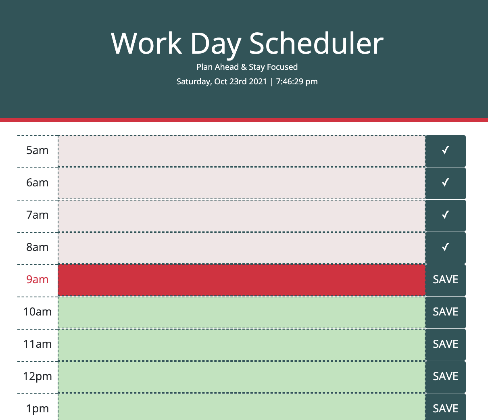
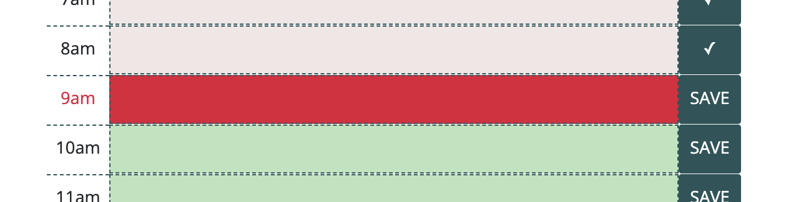
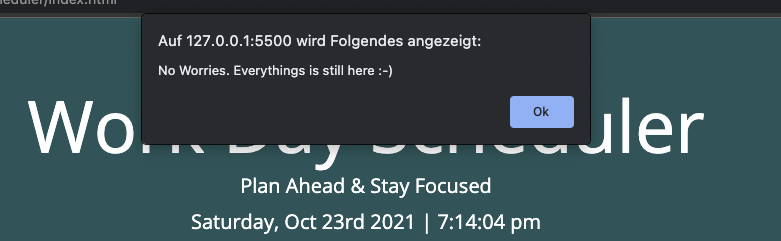

# Homework05WorkDayScheduler

Repo for week 5 assignment

This is the repository to hand in the homework from week 5

# Links to the files

- [GitHub Repository](https://github.com/laeuler/Homework05WorkDayScheduler)
- [GitHub Page](https://laeuler.github.io/Homework05WorkDayScheduler)

# Logic Flow and User Stories

The following lines describe the logic flow (order in which functions are executed)

### User Event: Startup of page

- the page loads
- current data in local storage is loaded (function loadLocal)
- color coding is assigned to indicate the present time slot (function assignColor)
- current time and date are displayed in the header (function getTime)

### User Event: Save entries

- user clicks on save and triggers saving in local storage (function save(e))
- viusal feedback (SAVE lits up in neon green for 500ms), that something happened

### User Event: Clear all entries

- user gets asked if he is really sure about that
- if the user confirms, the local storage gets cleared (function clearLocal)

# Mock-Up

The following image shows the web application's appearance and functionality:
Screenshotted with MacOS

### General Appearance

If the user scrolls to the bottom, the header sticks at the top

### Header Showing the Day, Date and Time

### Visual Coding to indicate wether the slot is in the past, present or future

- Past: Text background is more subtle, SAVE button converts to checkmark
- Present: Time is displayed in red tone, background of text as well. Text color is white
- Future: background is green
  

### Button at the bottom to clear all entries to start new day planning

It would be very annoying to delete everything manually. So I created a bottom at the bottom that lets the user easily clear all entries.

In order to prevent accidental deletion, a dialogue of confirms is initiated

#### Ask

#### Answer: Yes

#### Answer: No

# Closing Remarks

Looking forward to the feedback

Lars
